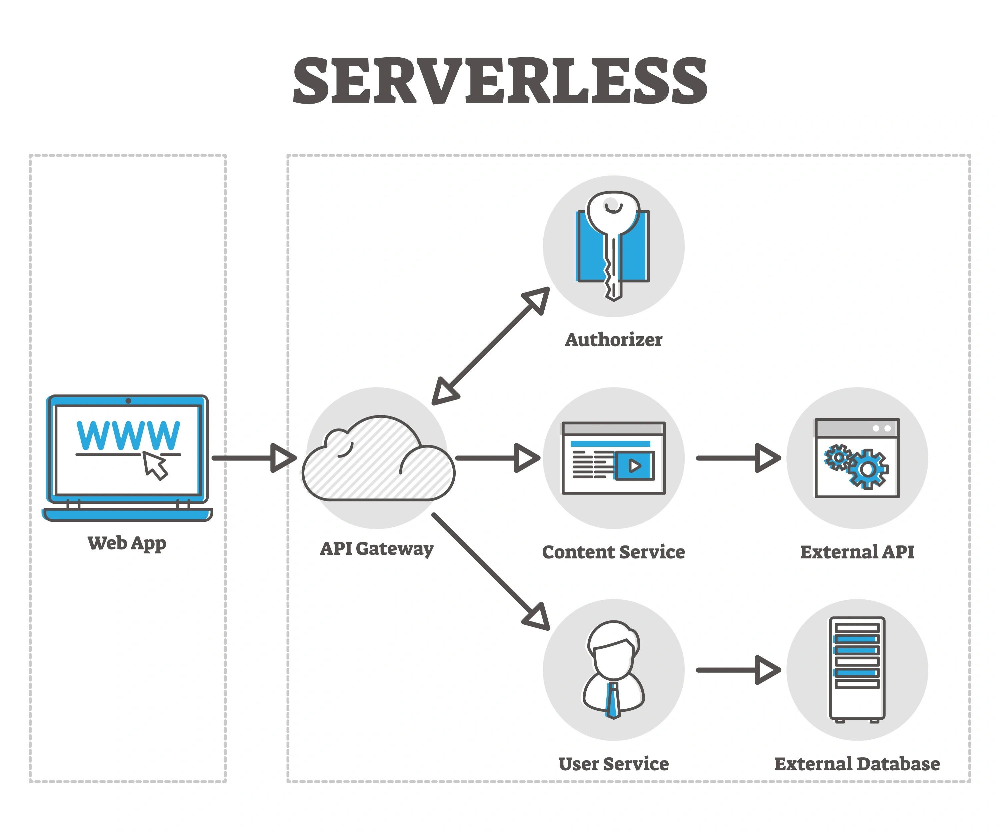

# Backend Gateway (Firebase Cloud Functions)

A secure, serverless backend gateway designed to handle sensitive logic and third-party API integrations for static frontends. This architecture ensures that private API keys and business logic remain protected from the client side.



## Architecture Overview

This project serves as the bridge between a **static frontend (Astro/GitHub Pages)** and private services. By moving sensitive operations (like reCAPTCHA verification) to this gateway, we eliminate the risk of exposing provider secrets in the browser.

- **Frontend**: Hosted on GitHub Pages (Static).
- **Backend**: Firebase Cloud Functions (Node.js/TypeScript).
- **Communication**: Secure HTTPS requests with restricted CORS.

---

## Core API Endpoints

### 1. `validateRecaptcha`

Integrates with **Google reCAPTCHA v3** to analyze user behavior and assign a bot-likelihood score.

- **Endpoint:** `https://<REGION>-<PROJECT_ID>.cloudfunctions.net/validateRecaptcha`
- **Method:** `POST`
- **Security:** \* **CORS Protection**: Access is restricted to authorized origins only.
  - **Secret Manager**: The reCAPTCHA Private Key is injected at runtime via Firebase Secrets.
- **Request Schema:**
  ```json
  { "token": "string" }
  ```
- **Response Schema:**
  ```json
  {
    "isValid": "boolean",
    "score": "number (0.0 - 1.0)"
  }
  ```

---

## Security & Environment

This repository follows industry standards for security. **No sensitive credentials (API Keys, Secrets) are stored in this codebase.**

### Secret Management

We utilize **Google Cloud Secret Manager** via Firebase CLI. To set up the required environment, use:

```bash
firebase functions:secrets:set RECAPTCHA_SECRET_KEY
```
